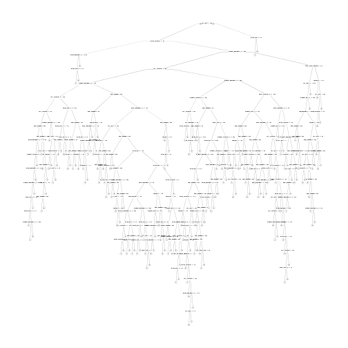

Activity Quality Prediction
========================================================

# Executive summary

The objective of this study is to build a model which perdicts how well a particular activity is performed. For this information of personal activity has been colected. This "classe" variable in the training data has to be modeled based on the other data gathered. this report includes a model generated with cross validation, we include and analysis of error. Finally, the model is used to predict 20 unseen test cases.

# Data analysis

The first step for the analysis was to load the data and to perform a summary function to identify populated variables. We see from the summary stats that there are a large number of variables which are only recorded at the end of an activity window. This variables with NA values are to be excluded during the model generation.


```r
setwd("/home/mario/pml/pa01")
training <- read.csv("pml-training.csv")
testing <- read.csv("pml-testing.csv")
# summary(training) summary(testing)
library(caret)
```

```
## Loading required package: lattice
## Loading required package: ggplot2
```

```r
library(e1071)
library(rpart)
library(rpart.plot)
set.seed(1234)
```


In order to predict the activity quality from activity monitors we use the "rpart" method of the rpart package of R. This tree model requires the parameter "cp" to be defined. For "cp" we try several values of this parameter to be part of the cross validation. In order to implement cross validation we use the implementation available in the caret package with the parameter trControl and our different values for cp, for this we first define a train control "tr.control" with a number of 10 folds. With this train control and the variables identified not to have NA values we train the tree algorithm. Once trained the classification tree is shown.


```r
# Number of folds
tr.control = trainControl(method = "cv", number = 10)
# cp values
cp.grid = expand.grid(.cp = (0:10) * 0.001)
# Cross-validation
tr = train(classe ~ num_window + roll_belt + pitch_belt + yaw_belt + total_accel_belt + 
    gyros_belt_x + gyros_belt_y + gyros_belt_z + accel_belt_x + accel_belt_y + 
    accel_belt_z + magnet_belt_x + magnet_belt_y + magnet_belt_z + roll_arm + 
    pitch_arm + yaw_arm + total_accel_arm + gyros_arm_x + gyros_arm_y + gyros_arm_z + 
    accel_arm_x + accel_arm_y + accel_arm_z + magnet_arm_x + magnet_arm_y + 
    magnet_arm_z + roll_dumbbell + pitch_dumbbell + yaw_dumbbell + total_accel_dumbbell + 
    gyros_dumbbell_x + gyros_dumbbell_y + gyros_dumbbell_z + accel_dumbbell_x + 
    accel_dumbbell_y + accel_dumbbell_z + magnet_dumbbell_x + magnet_dumbbell_y + 
    magnet_dumbbell_z + roll_forearm + pitch_forearm + yaw_forearm + total_accel_forearm + 
    gyros_forearm_x + gyros_forearm_y + gyros_forearm_z + accel_forearm_x + 
    accel_forearm_y + accel_forearm_z + magnet_forearm_x + magnet_forearm_y + 
    magnet_forearm_z, data = training, method = "rpart", trControl = tr.control, 
    tuneGrid = cp.grid)
# Extract tree
best.tree = tr$finalModel
prp(best.tree)
```

```
## Warning: labs do not fit even at cex 0.15, there may be some overplotting
```

 


Once generated, the model we created a validation table of the predictions obtained for the training data. We show the table bellow.


```r
# Test over training data
best.tree.pred = predict(best.tree, newdata = training)
answers = NULL
for (i in 1:length(best.tree.pred[, 1])) {
    answers <- rbind(answers, names(which.max(best.tree.pred[i, ])))
}
table(training$classe, answers)
```

```
##    answers
##        A    B    C    D    E
##   A 5534   23    7    7    9
##   B   49 3665   42   26   15
##   C   12   18 3360   27    5
##   D    9   17   45 3123   22
##   E    5   44    7   17 3534
```


As we can see, the error estimation of our model is 0.0207. Having an error rate very low we expect a similar result for the testing data.

Finally we test our model using the 20 cases never seen before. We obtain a summary table with only one miss classification of the activity.


```r
# Make predictions
best.tree.pred = predict(best.tree, newdata = testing)
answers = NULL
for (i in 1:20) {
    answers <- rbind(answers, names(which.max(best.tree.pred[i, ])))
}
real.answers <- c("B", "A", "B", "A", "A", "E", "D", "B", "A", "A", "B", "C", 
    "B", "A", "E", "E", "A", "B", "B", "B")
table(real.answers, answers)
```

```
##             answers
## real.answers A B C D E
##            A 7 0 0 0 0
##            B 1 7 0 0 0
##            C 0 0 1 0 0
##            D 0 0 0 1 0
##            E 0 0 0 0 3
```

We get an error rate of out of sample 0.05. Which we consider to be a good error rate and allowed us to get all but one of the answers of the homework correctly.

